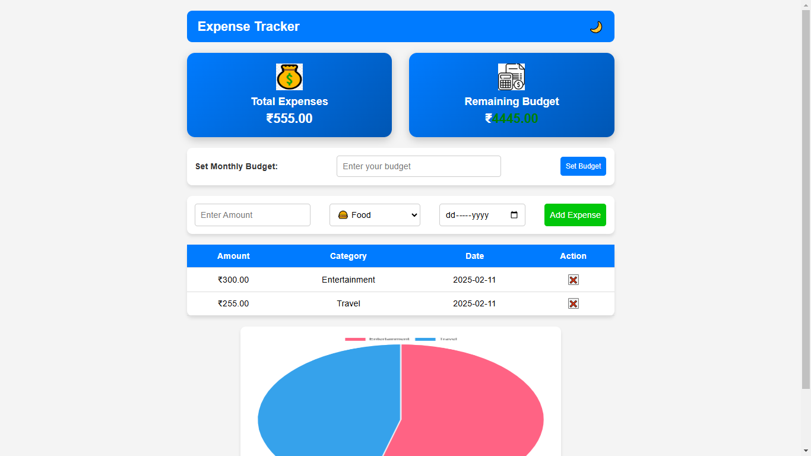

# 💰 Expense Tracker Web App  

A modern, easy-to-use **Expense Tracker** that helps you track your daily spending and stay within budget.  

🚀 **Live Website**: [Click Here](https://Vaishnaviiii-23.github.io/Expense-Tracker/)  

---

## 📌 Features  
✅ Add, edit, and delete expenses  
✅ Set a monthly budget and track remaining balance  
✅ Interactive charts to analyze spending patterns  
✅ Dark mode toggle for better UI experience  
✅ Mobile-friendly and responsive  

---

## 🖼️ Screenshots  


---

## 🛠️ Tech Stack  
- **HTML, CSS, JavaScript** – Frontend  
- **Chart.js** – For interactive charts  
- **LocalStorage** – Saves expenses persistently  

---

## 🚀 How to Run Locally  
1. Clone this repository:  
   ```sh
   git clone https://github.com/Vaishnaviiii-23/Expense-Tracker.git
2. Open the project folder in VS Code.
3. Open home.html in a browser or use Live Server.
🤝 Contributing
If you have any suggestions or want to improve the project, feel free to fork and create a pull request!
📩 Contact
Vaishnavi P Poojari
📧 vaish3229@gmail.com
🔗 GitHub
🎉 If you like this project, don’t forget to ⭐ the repository!

---

### **✅ Step 2: Add and Push the README to GitHub**
1. **Save the file (`Ctrl + S`)**.  
2. **Open Git Bash** and run these commands:  

git add README.md
git commit -m "Added README file"
git push origin main
